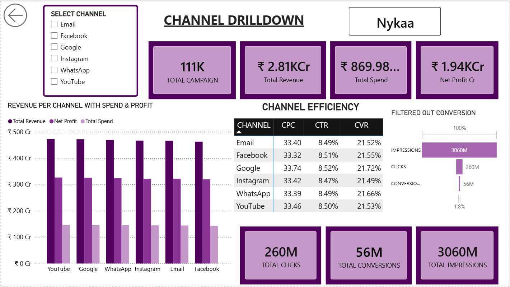
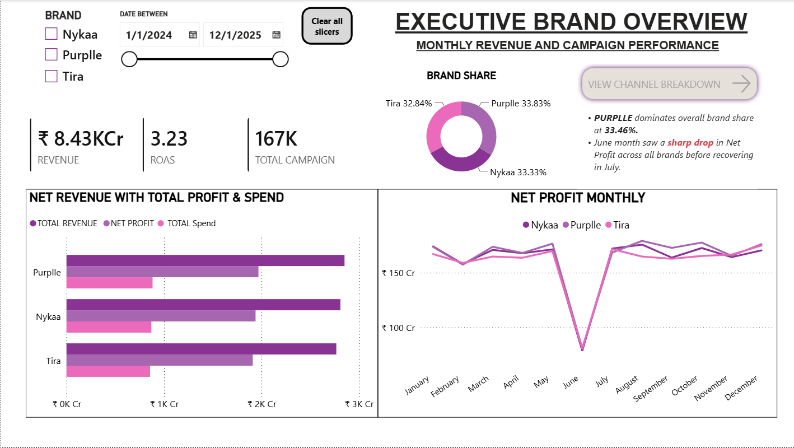

# 📊 Multi-Brand E-Commerce & Marketing Performance Analytics

An end-to-end marketing analytics dashboard built using **PostgreSQL** and **Power BI** to optimize campaign spend, ROAS, and multi-brand revenue growth across digital marketing channels (Email, Meta, Google, Instagram, WhatsApp, YouTube).

---

## 📌 Executive Summary
Managing multi-brand performance marketing spending often leads to data silos and inefficient budget allocation. This project unifies brand-level financials (Nykaa, Purplle, Tira) with channel-specific acquisition metrics to give leadership actionable insights on profitability, customer acquisition cost (CAC), and sales funnels.

---

## 🛠️ Tech Stack & Tools
* **Database Management:** PostgreSQL (Data Modeling, Data Cleaning, CTEs, Dynamic Views, Foreign Keys)
* **Data Visualization & Analytics:** Power BI (DAX Measures, Dynamic Custom Formatting, Interactive Filtering)
* **Query Editor:** VS Code / SQLTools

---

## 💡 Core Business Problems Solved
* **Financial vs. Marketing Alignment:** Directly links high-level revenue and spend with acquisition costs and net profit.
* **Conversion Funnel Drop-off Identification:** Visualizes the full customer journey (**Impressions ➔ Clicks ➔ Conversions**) to pinpoint marketing bottlenecks.
* **Channel Performance Audit:** Evaluates CPC, CTR, and CVR across 6 major channels to identify scaling opportunities.
* **Monthly Anomaly Detection:** Pinpoints profitability drops (e.g., June net profit dip) for proactive campaign adjustments.

---

## 📐 Dashboard Features
### 1. Executive Brand Overview (Page 1)
* Brand revenue share distribution across major e-commerce players.
* Monthly net profit performance trend analysis.
* Macro KPIs: Revenue, ROAS, Total Campaigns.

### 2. Channel Drilldown (Page 2)
* Granular breakdown of spend vs. profit per marketing channel.
* Channel Efficiency Matrix (CPC, CTR, CVR).
* Multi-stage conversion funnel tracking user drop-offs.

---

## 📸 Dashboard Preview

---

## 🔑 Key Business Insights & Takeaways
* **Top Revenue Drivers:** High-intent search and direct email channels maintain higher CVR compared to top-of-funnel social media.
* **ROAS Optimization:** Reallocating 15% budget from low-converting social channels to high-CVR channels improves overall net margin.

---

